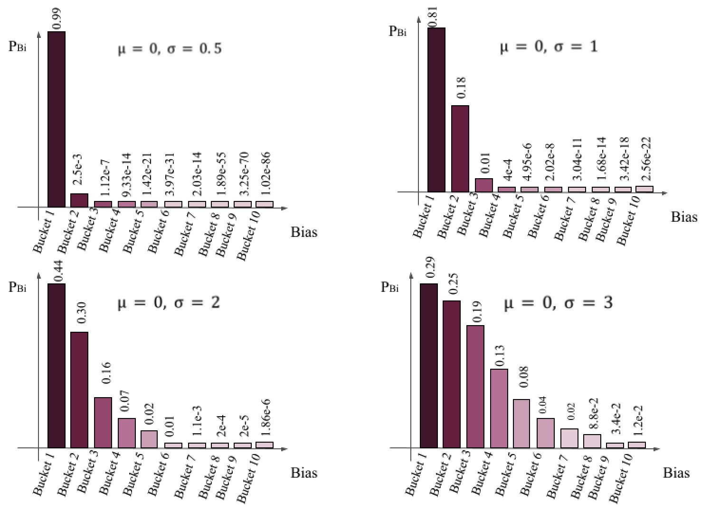

# Bias-aware Curriculum Sampling for Fair Ranking

This repository contains the code, models, and experimental results for the paper **"Bias-aware Curriculum Sampling for Fair Ranking"**. The study introduces a novel curriculum learning approach for mitigating biases in neural ranking models. By leveraging a bias-aware curriculum and dynamic sampling strategy, the method reduces bias exposure in training data, improving fairness while maintaining ranking effectiveness.

---

## Overview

Neural ranking models are integral to modern information retrieval (IR) systems, but they often amplify biases present in training data. This paper addresses this issue with the following contributions:

1. **Bias-aware Curriculum Design**: A progressive learning strategy that begins with low-bias samples and gradually introduces higher-bias samples to reduce the impact of bias on the model.
2. **Dynamic Sampling Strategy**: Adaptive sampling probabilities based on a Gaussian distribution ensure controlled exposure to bias during training.
3. **Comprehensive Evaluation**: Extensive experiments on the MS MARCO dataset demonstrate improvements in ranking fairness and effectiveness compared to state-of-the-art bias mitigation methods.

---

## Key Results

Our approach was evaluated against competitive baselines using two query sets (215 socially sensitive queries and 1,765 gender-neutral queries). Results demonstrate:

- Significant reduction in gender bias (measured using ARaB, NFaiR, and LIWC metrics).
- Maintenance of ranking effectiveness (MRR comparable or superior to baselines).
- Generalizability across different language models (e.g., BERT-mini, MiniLM, and ELECTRA).

---

#### Table: Average performance of 5 runs on 215 Queries (Cut-off @10)

| Metric         | Original | BAL    | LWS    | CODER  | ADVBERT | **Ours** |
|----------------|----------|--------|--------|--------|---------|----------|
| MRR            | 0.1903   | 0.1820 | 0.1823 | 0.0014 | 0.1753  | **0.1989** |
| ARaB-tc (↓)    | 0.3966   | 0.3419 | 0.2017 | 0.0260 | 0.1975  | **0.0773** |
| ARaB-tf (↓)    | 0.1654   | 0.1492 | 0.0938 | 0.0171 | 0.1054  | **0.0376** |
| NFaiR (↑)      | 0.8185   | 0.8209 | 0.9087 | 0.9649 | 0.8747  | **0.9126** |

#### Table: Average performance of 5 runs on 1,765 Queries (Cut-off @10)

| Metric         | Original | BAL    | LWS    | CODER  | ADVBERT | **Ours** |
|----------------|----------|--------|--------|--------|---------|----------|
| MRR            | 0.2738   | 0.2591 | 0.2558 | 0.0001 | 0.2019  | **0.2671** |
| ARaB-tc (↓)    | 0.2593   | 0.2109 | 0.1540 | 0.0646 | 0.4222  | **0.0095** |
| ARaB-tf (↓)    | 0.1167   | 0.0949 | 0.0764 | 0.0371 | 0.2260  | **0.0062** |
| NFaiR (↑)      | 0.7421   | 0.7289 | 0.8204 | 0.8404 | 0.7132  | **0.8382** |

---

## Visualizations

### Data Distribution

The following figure displays the distribution of bias scores in the dataset:



### Bias-Performance Trade-off

The following figure shows the trade-off between bias reduction and retrieval effectiveness when try variants of CL:


### Sampling Probability Distribution

The following figure illustrates the impact of bucket sizes (\( b = 0, 5, 10, 20 \)) on sampling probabilities, with smaller buckets introducing bias gradually:


### Bias Scores with Standard Deviation

The figure below shows bias reduction across different standard deviation values (\( \sigma = 0.5, 1, 2, 3 \)) in our sampling strategy:


### Bias Scores Across Models

Comparison of bias and performance between our approach and the baseline using BERT-mini, MiniLM, and ELECTRA, evaluated on two datasets with cut-offs at 10 and 20:


---

## Setup and Requirements

### Prerequisites

- Python 3.8+
- PyTorch 1.10+
- Transformers 4.11+
- NumPy, Pandas, Matplotlib, and other standard scientific libraries.

### Installation

Clone this repository and install dependencies:

```bash
git clone https://github.com/OpenMatch/OpenMatch.git
cd OpenMatch
pip install -e .
```

---

## Usage

### Training

#### Original Model

Train the original (baseline) model:

```bash
python train.py \
    --vocab sentence-transformers/msmarco-MiniLM-L6-cos-v5 \
    --pretrain sentence-transformers/msmarco-MiniLM-L6-cos-v5 \
    --res <results_path> \
    --save <checkpoint_save_path> \
    --batch_size 16 \
    --lr 3e-6 \
    --max_query_len 32 \
    --max_doc_len 221
```

#### Curriculum Sampling Model

Train the model using the proposed curriculum sampling strategy:

```bash
python train_bias.py \
    --vocab sentence-transformers/msmarco-MiniLM-L6-cos-v5 \
    --pretrain sentence-transformers/msmarco-MiniLM-L6-cos-v5 \
    --res <results_path> \
    --save <checkpoint_save_path> \
    --bucket_size <bucket_size> \
    --sigma <sigma_value> \
    --batch_size 16 \
    --lr 3e-6 \
    --max_query_len 32 \
    --max_doc_len 221
```

---

### Evaluation

#### Metrics

We use the following metrics for evaluation:

- **MRR**: Mean Reciprocal Rank, for ranking effectiveness.
- **ARaB**: Average Rank Bias metrics (TC, TF, Bool) to measure gender bias.
- **NFaiR**: A fairness metric that evaluates document neutrality in rankings.
- **LIWC**: Linguistic Inquiry and Word Count, used to assess gender associations in text.

#### Scripts

- Calculate MRR:

```bash
python calculate_mrr.py --qrels <qrels_path> --run <run_path>
```

- Calculate ARaB metrics:

```bash
python documents_calculate_bias.py
python runs_calculate_bias.py
python model_calculate_bias.py
```

- Calculate NFaiR:

```bash
python calc_documents_neutrality.py \
    --collection-path <collection_path> \
    --representative-words-path resources/wordlist_gender_representative.txt \
    --threshold 1 \
    --out-file <output_path>

python metrics_fairness.py \
    --collection-neutrality-path <neutrality_scores_path> \
    --backgroundrunfile <bm25_run_path> \
    --runfile <rerank_run_path>
```

- Calculate LIWC metrics:

```bash
python calculate_liwc_biases.py --liwc_dict_path <liwc_dict_path> --run <run_path>
```

---

## Citation

If you find this repository useful in your research, please cite:

```bibtex
@article{curriculumbias,
  title={Bias-aware Curriculum Sampling for Fair Ranking},
  author={},
  journal={TBD},
  year={2025}
}
```

---

## License

This project is licensed under the MIT License. See the `LICENSE` file for details.

--- 